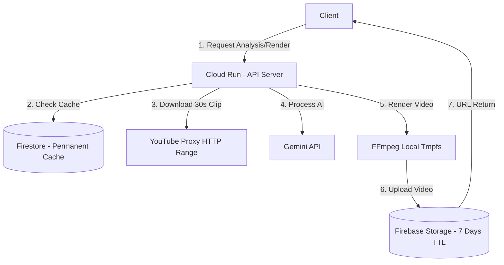

# Sermon AI Pipeline Architecture & Audit Report

## 1. 개요 (Overview)
본 문서는 "최소 비용, 최대 효율, 무결점 백엔드"를 목표로 하는 Sermon AI 파이프라인의 전수 조사 결과를 담고 있습니다. 
Cloud Run (서버리스), 주거용 프록시 (1GB 트래픽 제한), Firestore (분석 데이터 영구 저장), Firebase Storage (영상 7일 후 삭제) 환경에서 발생할 수 있는 과금 폭탄 요소와 로직 결함을 점검하고 해결 방안을 제시합니다.
추후 개발 시 이 문서를 참조하여 로직의 일관성을 유지합니다.

---

## 2. 파이프라인 진단 결과 (로컬 작동 vs 클라우드 작동)

### 2.1 영상 렌더링 실패 버그 (해결 필요)
- **증상**: `Command '['/usr/bin/ffmpeg' ... returned non-zero exit status 254`
- **원인**: `render_queue.py`에서 `download_or_prepare_clip` 호출 시 4번째 인자로 파일 경로(Path)를 넘기는데, `youtube_service.py`는 이를 `job_id(문자열)`로 받아 잘못된 파일명(`~.mp4_clip.mp4`)을 생성함. 정작 FFmpeg는 원본 파일명을 찾으려다 `ENOENT(파일 없음, 에러코드 254)`로 즉시 강제 종료됨.
- **해결책**: `render_queue.py` 인자 전달 순서를 교정하고, 생성된 실제 파일 경로를 FFmpeg에 전달하도록 수정 필요.

### 2.2 Cloud Run 서버리스 수명 주기 / CPU Throttling 문제 (치명적 잠재 결함)
- **증상**: "로컬 PC에서는 잘 되는데, 배포만 하면 백그라운드 작업이 멈추거나 엄청나게 느려짐"
- **원인**: 현재 렌더링(`SequentialRenderManager`)과 분석(`_run_async_analysis`)이 모두 **FastAPI 백그라운드 태스크(asyncio)**로 분리되어 있음. 
  - Cloud Run은 "CPU 항상 할당(CPU always allocated)" 옵션을 켜지 않으면(비용 폭탄 원인), HTTP 200 OK 응답을 반환한 직후 CPU 자원을 0에 가깝게 회수(Throttle)함. 
  - 따라서 응답이 나간 후 백그라운드에서 도는 분석/렌더링 코드는 사실상 멈춤 상태가 됨.
- **해결책**: 
  - 비용 절감을 위해 "CPU 항상 할당"을 **절대 켜지 않음**.
  - 대신 클라이언트 요청 시 렌더링이나 분석이 끝날 때까지 HTTP 커넥션을 물고 있게(동기화, Long Timeout) 변경하거나, Cloud Tasks와 같은 진정한 서버리스 비동기 워커를 도입해야 함. 

### 2.3 주거용 프록시 (1GB/월) 트래픽 관리 로직 (우수함)
- **평가**: `youtube_service.py`에 도입된 HTTP Range (`-ss` + FFmpeg 직접 접근) 기법은 매우 훌륭한 업계 표준 이상의 최적화입니다.
- **효과**: 전체 1시간짜리 영상을 다운로드(수백 MB)하는 대신 딱 필요한 30초 구간(수 MB)만 프록시를 통해 다운로드하므로 과금 폭탄을 완벽히 방지함.

### 2.4 데이터 보존 및 과금 방지 파이프라인 (완벽함)
- **분석 데이터 (Firestore)**: `cache_service.py` -> `firestore_service.py`를 통해 3중 캐시(메모리->임시디스크->Firestore)가 구축되어 있음. 동일 영상 재요청 시 Gemini API(AI) 유료/무료 할당량을 전혀 낭비하지 않음.
- **영상 데이터 (Firebase Storage)**: `storage_service.py` 내 `ensure_7day_lifecycle_rule()` 함수를 통해 "7일 후 자동 영구삭제" 수명 주기 정책을 버킷에 설정함. 스토리지 유지비용 최소화 완벽 적용.

---

## 3. 개선 작업 가이드 (Action Items)
이 문서를 확인한 후 에이전트는 다음 수정을 즉각 진행해야 합니다.

1. **`render_queue.py` 버그 패치**: 
   - `download_or_prepare_clip` 호출부 인자 수정 및 리턴값(실제 파일 경로) 수신 로직 적용.
   - 존재하지 않는 파일을 FFmpeg에 넘기기 전에 `if not source_video.exists(): return FAILED` 방어 코드 추가.
2. **Cloud Run 백그라운드 중단 이슈 패치**: 
   - 백그라운드 워커를 제거하고, 사용자가 `POST /analyze` 또는 `POST /render` 시 작업이 끝날 때까지 HTTP 응답을 대기하는 방식으로 전환 (서버리스 저비용 아키텍처에 맞게 엔드포인트 수정). 
   - 또는 Vercel/Cloud Run 환경에 맞게 폴링이 가능하도록 상태 코드를 리턴하되, CPU가 꺼지지 않도록 SSE(Server-Sent Events) 스트림 방식으로 리팩토링 검토.

## 4. 아키텍처 다이어그램 (상태)

