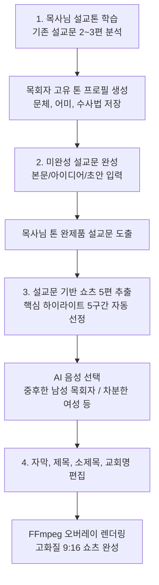

# 📋 작업 계획서: 구글 무료 생태계 기반 맞춤 설교문 완성 & AI 음성 쇼츠 제작 시스템

> **핵심 원칙**: 
> - 추가 외부 유료 결제 없이 **Google Gemini + Google TTS(매월 100만 자 무료)** 생태계 활용 (과금 0원 / 월 약 3,300편 제작 가능)
> - 일반 PC 및 모바일 브라우저에서도 빠르고 가볍게 100% 작동
> - 직관적인 4단계 워크플로우 구축

---

## 🎯 전체 워크플로우 요약

---

## 📌 세부 기능별 구현 계획

### 1단계: 목사님의 설교문 어투, 문법, 표현 학습
- **목적**: 목사님 고유의 언어적 특성(자주 쓰는 어휘, 문장 종결 어미, 강조 화법, 예화 전개 스타일)을 AI에 프로필화.
- **입력**: 기존 설교문 텍스트 샘플 2~3편 (각 1,000자 이상).
- **기술 스택**: `gemini-3.5-flash-lite` (초경량/고속, 비용 사실상 0원).
- **출력 결과 (JSON 프로필 저장)**:
  - 톤 명칭 (예: *온유하고 깊이 있는 성경 강해형*)
  - 대표 종결 어미 (예: *~하십시오, ~인 줄로 믿습니다*)
  - 주요 빈출 영적 키워드
  - 시스템 프롬프트용 톤 지침 (System Instruction)
- **보관**: 브라우저 `localStorage` 및 계정 프로필에 영구 저장 (매번 재학습 불필요).

---

### 2단계: 미완성 설교문/아이디어 ➜ 완성된 설교문 생성
- **목적**: 바쁜 목회자가 핵심 아이디어, 성경 본문 구절, 간단한 메모만 입력해도 목사님 본인의 설교문 형태로 3단 구성(도입-본론-결단) 완성.
- **입력**: 
  - 설교 제목 및 성경 본문 (예: *누가복음 5:1~11*)
  - 핵심 아이디어 / 묵상 메모 (단문 가능)
- **AI 엔진**: `gemini-3.8-flash` + 1단계에서 학습된 목사님 톤 프로필 주입.
- **결과물**:
  - 서론 (성도의 삶과 연결하는 도입부)
  - 본론 (3가지 대지 및 핵심 강해)
  - 결론 및 기도문 (결단과 적용)
  - *텍스트 에디터에서 목사님이 직접 수정 가능하도록 제공*.

---

### 3단계: 완성된 설교문으로 쇼츠 5개 추출 & AI 음성 합성
- **목적**: 긴 설교문을 1분 분량의 쇼츠 5편으로 자동 분할하고, 듣기 좋은 설교자 AI 음성 입히기.
- **쇼츠 5편 자동 기획 (AI)**:
  - 쇼츠 1~5번 각각의 **짧고 굵은 제목**(상단 1줄) & **도발적인 소제목**(상단 2줄).
  - 40~50초 분량의 대본 텍스트 및 문장별 시간 타임스탬프 계산.
- **구글 무료 고품질 TTS 음성 선택 옵션**:
  - 🎙️ **남성 A (신뢰감 있는 중후한 목회자 톤)** - Google Journey / Neural2
  - 🎙️ **남성 B (따뜻하고 온유한 강해 설교 톤)**
  - 🎙️ **여성 A (차분하고 또렷한 성경 묵상 톤)**
  - 🎙️ **여성 B (밝고 은혜로운 나레이션 톤)**
- **비용**: Google TTS 매월 100만 자 무료 혜택 적용 (월 3,000편 이상 완전 무료).

---

### 4단계: 실시간 편집 (자막, 제목, 소제목, 교회명) 및 렌더링
- **편집 UI 모달**:
  - **제목 (상단 1줄)**: 1줄 자동 피팅 적용된 크고 굵은 제목 편집.
  - **소제목 (상단 2줄)**: 옐로우 포인트 소제목 편집.
  - **문장별 자막**: 오탈자 수정, 줄바꿈 위치 직접 변경 가능.
  - **교회/채널명**: 하단 텍스트 직접 입력.
  - **배경 화면 / BGM 선택**: 은혜로운 잔잔한 피아노 BGM 3종 중 선택.
- **렌더링 엔진 (FFmpeg + Pillow)**:
  - 목사님 AI 음성 + 980px 자동 안착 헤드라인 + 860px 이내 멀티라인 둥근 자막 박스 + 배경 영상을 결합하여 1080x1920 세로형 MP4 영상 생성.

---

## 📅 구현 단계별 일정 (작업 착수 시 순서)

| 단계 | 작업 내용 | 예상 소요 |
| :---: | :--- | :---: |
| **Step 1** | **백엔드 Google TTS 음성 모듈 추가** - 고품질 무료 음성 합성 모듈 연동 - 목회자 스타일 음성 프리셋 4종 탑재 | 15분 |
| **Step 2** | **설교문 ➜ 쇼츠 5편 분할 & 음성 대본 AI 프롬프트 구현** - 텍스트 설교문에서 5구간 자동 추출 로직 연동 | 15분 |
| **Step 3** | **프론트엔드 UI 확장 ([UploadTab.jsx])** - 1. 설교톤 학습 UI 보완 - 2. 미완성 설교 완성 폼 - 3. 음성 선택 드롭다운 및 '쇼츠 5편 일괄 생성' 버튼 | 20분 |
| **Step 4** | **편집 모달 및 렌더링 큐 연동** - 제목/소제목/자막/교회명 수정 후 즉시 렌더링 파이프라인 연결 | 15분 |
